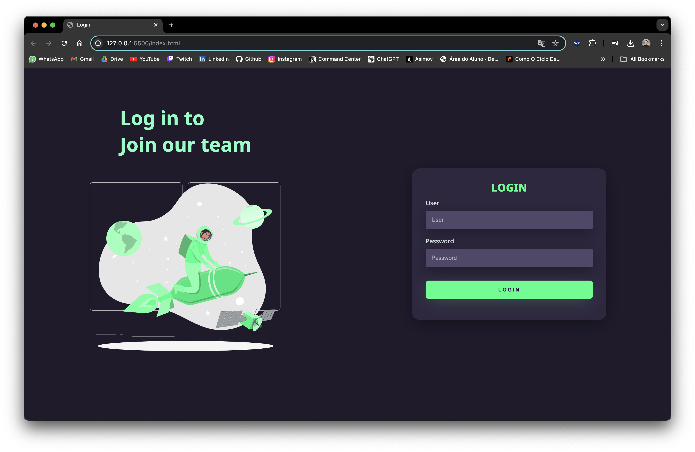

# Landing Page Project

This project is a login screen page I created to practice my HTML and CSS skills. It showcases a clean, responsive design inspired by various internet templates. The design demonstrates my ability to adapt and implement web development techniques learned from these resources, focusing on creating an aesthetically pleasing and functional user interface.

## Overview

Here is a preview of the page:



## How to Run the Project

1. Clone this repository:
   ```bash
   git clone https://github.com/Victor-Amarante/login-screen-frontend.git
